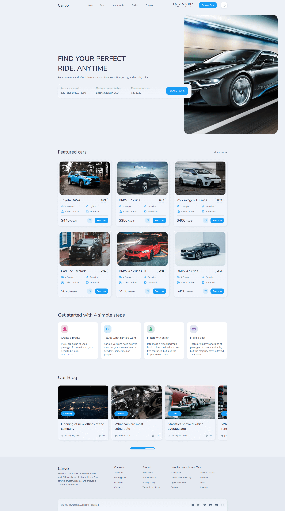

<div>
  <h1>Carvo — Car Rental Landing Page</h1>

  <p>
    A modern and fully responsive car rental landing page, <br />
    built using HTML, CSS, and JavaScript. Perfect for showcasing rental vehicles with style.
  </p>

  <p>
    <strong>Note:</strong> I started building HTML, CSS, and JavaScript projects in 2022. <br />
    At that time, I focused on learning first and began uploading to GitHub recently. <br />
    Now I'm working with React.js and Next.js, and seeking opportunities as a frontend or web developer.
  </p>
</div>

## What's Inside
- `index.html` — complete page structure and content
- `assets/css/style.css` — comprehensive styling with customizable `:root` CSS variables
- `assets/js/script.js` — mobile menu toggle and header scroll effects
- `assets/images/` — car photos, hero banner, blog images, and favicon

## Technologies Used
HTML5 · CSS3 · Vanilla JavaScript · Google Fonts (Nunito, Open Sans) · Ionicons

## Features
- Fully responsive layout across all devices (mobile, tablet, desktop)
- Interactive mobile navigation with smooth toggle animation
- Hero section with advanced search form (brand, budget, year filters)
- Featured cars showcase with detailed specifications and pricing
- Step-by-step rental process guide with icon-based cards
- Blog section with horizontal scrolling functionality
- Favorite button interaction for each car listing
- Scroll-based header styling with active state

## Quick Start
1. **Clone the repository:**  
   ```bash
   git clone https://github.com/nawazdevx/carvo-rental.git
   ```

2. **Open the project:**  
   - Simply open `index.html` in your browser  
   - Or run a local server:  
     ```bash
     python -m http.server 3000
     ```
     Then visit `http://localhost:3000`

## Customization
- Edit site content, meta tags, and car listings in `index.html`
- Swap images in `assets/images/` folder (maintain filenames or update references)
- Modify colors, fonts, and spacing through `:root` variables in `style.css`
- Adjust grid layouts and breakpoints in the media queries section
- Connect the hero search form to your backend or a third-party service

## License
This project is licensed under the [MIT License](https://choosealicense.com/licenses/mit/).

## Contact
If you want to contact me, you can reach me at [LinkedIn](https://www.linkedin.com/in/nawazdevx).

## Support
If you find this project useful, please consider starring it on GitHub ⭐ to show your support!

<br />

<div align="center">
  <h1>Project Preview</h1>
  
  <p>
    You can view the live project here ➜
    <a href="https://nawazdevx.github.io/carvo-rental/" target="_blank"><strong>Live Demo</strong></a>
  </p>

  
</div>