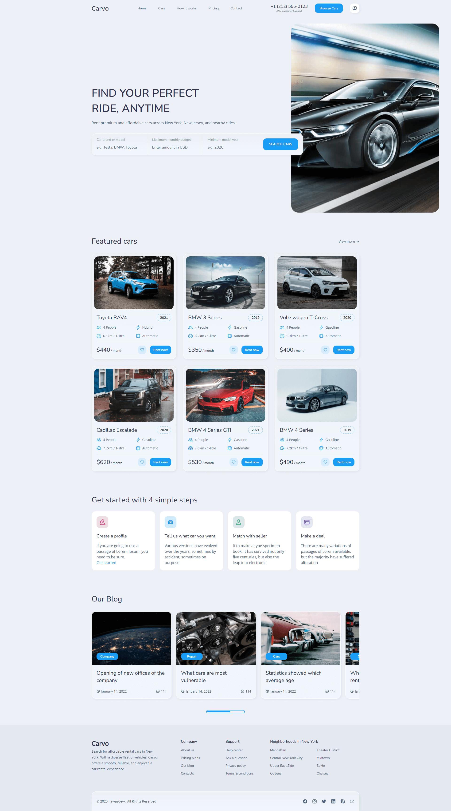

  <h1>Carvo - Car Rental</h1>

  

    <strong>About Project:</strong> 
    A responsive car rental website featuring a hero search form, featured vehicle gallery with detailed car cards, step-by-step rental process guide, and blog section. Built with semantic HTML5 structure, CSS custom properties for consistent theming, and vanilla JavaScript for mobile navigation. The design uses CSS Grid and Flexbox for layouts, smooth transitions throughout, and includes a multi-filter hero form for car searches.
  

  
 
    <strong>What I learned:</strong>
    Created mobile navigation with slide-in sidebar and overlay backdrop, structured multi-column form with border styling, implemented smooth transitions and hover effects, and organized reusable color schemes using CSS custom properties.
  

  
 
    <strong>Personal Note:</strong>
    I started building HTML, CSS, and JavaScript projects in 2022.  
    At that time, I focused on learning first and began uploading to GitHub recently.  
    Now I'm working with <strong>React.js</strong> and <strong>Next.js</strong>, and seeking opportunities as a <strong>frontend</strong> or <strong>web developer</strong>.
  

 
  
<h2>Project More Details</h2>

  
 
    
<h4>What's Inside</h4>

    <ul>
      <li><strong>Hero Section</strong> - Full-screen banner with heading, description, and multi-field search form for car filtering</li>
      <li><strong>Featured Cars Gallery</strong> - Six vehicle cards displaying car images, specifications (people capacity, fuel type, efficiency, transmission), year badges, and monthly pricing</li>
      <li><strong>Getting Started Guide</strong> - Four-step process cards with colored icons explaining how to rent a car (create profile, choose car, match with seller, make deal)</li>
      <li><strong>Blog Section</strong> - Horizontal scrollable list of five blog cards with images, category badges, titles, publish dates, and comment counts</li>
      <li><strong>Header Navigation</strong> - Fixed header with logo, navigation menu, contact phone number, browse cars button, and user account icon</li>
      <li><strong>Mobile Menu</strong> - Hamburger toggle button with slide-in sidebar navigation and overlay backdrop</li>
      <li><strong>Footer Section</strong> - Multi-column footer with company info, quick links, support links, neighborhood locations, social media icons, and copyright</li>
      <li><strong>Favorite Button</strong> - Heart icon on each car card for saving preferred vehicles</li>
    </ul>
  

  
 
    
<h4>Technologies Used</h4>

    <ul>
      <li><strong>HTML5</strong> - Semantic markup with proper document structure and accessibility attributes</li>
      <li><strong>CSS3</strong> - Modern styling with Grid, Flexbox, custom properties, gradients, and smooth transitions</li>
      <li><strong>JavaScript (ES6)</strong> - Vanilla JS for mobile menu toggle and scroll-based header styling</li>
      <li><strong>Google Fonts</strong> - Nunito and Open Sans font families for typography hierarchy</li>
      <li><strong>Ionicons 5.5.2</strong> - Icon library for UI elements and social media links</li>
      <li><strong>CSS Custom Properties</strong> - Organized color palette with 20+ color variables for easy customization</li>
      <li><strong>Media Queries</strong> - Five responsive breakpoints (350px, 580px, 768px, 992px, 1200px) for mobile-first design</li>
    </ul>
  

  
 
    
<h4>Project Structure</h4>

    <pre>
    carvo-rental/
    │
    ├── index.html                 # Main HTML with header, hero, featured cars, guide, blog, footer
    │
    ├── assets/
    │   ├── css/
    │   │   └── style.css         # All styles, layouts, animations, and responsive breakpoints
    │   │
    │   ├── js/
    │   │   └── script.js         # Mobile menu toggle and header scroll effect
    │   │
    │   └── images/               # Car images, blog thumbnails, hero banner, favicon
    │
    └── README.md                 # Project documentation
    </pre>
  

  
 
    
<h4>Key Features</h4>

    <ul>
      <li><strong>Fully Responsive Design</strong> - Adapts seamlessly from mobile screens to large desktops with five breakpoint ranges</li>
      <li><strong>Hero Search Form</strong> - Multi-field form with car model, budget, and year inputs for filtering vehicles</li>
      <li><strong>Car Showcase Cards</strong> - Six featured vehicles with images, specifications, pricing, and action buttons</li>
      <li><strong>Mobile Navigation</strong> - Slide-in sidebar menu with hamburger icon, overlay backdrop, and smooth animations</li>
      <li><strong>Sticky Header</strong> - Navigation bar becomes fixed with shadow effect when scrolling down the page</li>
      <li><strong>Process Guide Section</strong> - Four illustrated steps with custom colored icons showing the rental workflow</li>
      <li><strong>Horizontal Blog Scroll</strong> - Touch-friendly scrollable blog cards with custom scrollbar styling</li>
      <li><strong>Detailed Car Specs</strong> - Each card shows passenger capacity, fuel type, efficiency rating, and transmission type</li>
      <li><strong>Interactive Buttons</strong> - Hover effects with gradient overlays and shadow transitions on all buttons</li>
      <li><strong>Contact Information</strong> - Header displays phone number with 24/7 support label for easy access</li>
      <li><strong>Social Media Links</strong> - Footer includes six social platform icons with hover color changes</li>
      <li><strong>Gradient Backgrounds</strong> - Subtle linear gradients on cards and footer for modern aesthetic</li>
      <li><strong>Year Badges</strong> - Dashed border badges highlighting car model years on vehicle cards</li>
      <li><strong>Favorite Functionality</strong> - Heart icon button on each car for marking preferred vehicles</li>
      <li><strong>Cross-Browser Support</strong> - Works on Chrome, Firefox, Safari, Edge, and Opera browsers</li>
    </ul>
  

  
 
    
<h4>Quick Start</h4>

    <ol>
      <li>
        <strong>Clone the repository:</strong>
        <pre><code>git clone https://github.com/nawazdevx/carvo-rental.git</code></pre>
      </li>

      <li>
        <strong>Open the project:</strong>
        <ul>
          <li>Open <code>index.html</code> directly in your browser</li>
          <li>Or run a local server:</li>
        </ul>

        <pre><code>python -m http.server 3000</code></pre>
        Then visit <code>http://localhost:3000</code>
      </li>

      <li>
        <strong>Start Customizing:</strong>
        <ul>
          <li>Update company name and contact info in <code>index.html</code></li>
          <li>Change color scheme in <code>style.css</code> using CSS custom properties</li>
          <li>Replace car images and blog thumbnails in <code>assets/images/</code> folder</li>
          <li>Modify car details, pricing, and specifications in HTML</li>
        </ul>
      </li>
    </ol>
  

  
 
    
<h4>Customization</h4>

    <ul>
      <li><strong>Text Content:</strong> Edit directly in <code>index.html</code> - update car names, prices, descriptions, blog titles, and company information</li>
      <li><strong>Colors:</strong> Update CSS variables in <code>:root</code> selector at the top of <code>style.css</code>
        <pre><code>:root {
  --carolina-blue: hsl(204, 91%, 53%);     /* Primary blue color */
  --space-cadet: hsl(240, 22%, 25%);      /* Dark heading color */
  --independence: hsl(219, 21%, 39%);     /* Text color */
  --alice-blue-1: hsl(216, 38%, 95%);     /* Background color */
}</code></pre>
      </li>
      <li><strong>Images:</strong> Replace files in <code>assets/images/</code> with your own car photos and blog images (keep same filenames or update HTML references)</li>
      <li><strong>Fonts:</strong> Change Google Fonts link in HTML <code>&lt;head&gt;</code> and update <code>--ff-nunito</code> and <code>--ff-open-sans</code> variables</li>
      <li><strong>Car Cards:</strong> Add or remove vehicle cards by duplicating/deleting <code>&lt;li&gt;</code> elements in the featured cars section</li>
      <li><strong>Navigation:</strong> Modify menu items in <code>navbar-list</code> and update corresponding section IDs</li>
      <li><strong>Footer Links:</strong> Update footer navigation lists and social media URLs in the footer section</li>
      <li><strong>Responsive Breakpoints:</strong> Adjust media query values in CSS to change when layout shifts occur</li>
    </ul>
  

 
  <strong>License:</strong>
  This project is licensed under the <a href="https://choosealicense.com/licenses/mit/">MIT License</a>.

 
  <strong>Contact:</strong> 
  Connect with me on <a href="https://www.linkedin.com/in/nawazdevx">LinkedIn</a> or visit my <a href="https://nawazdevx.vercel.app/">Portfolio</a>.

 
  <strong>Support:</strong> 
  Found this helpful? Give it a ⭐ on GitHub! Thank you.

 

  <h2>Project Preview</h2>

  

    <strong>You can view the live project here ➜</strong>
    <a href="https://nawazdevx.github.io/carvo-rental/" target="_blank">
      <strong>Live Demo</strong>
    </a>
  

  

